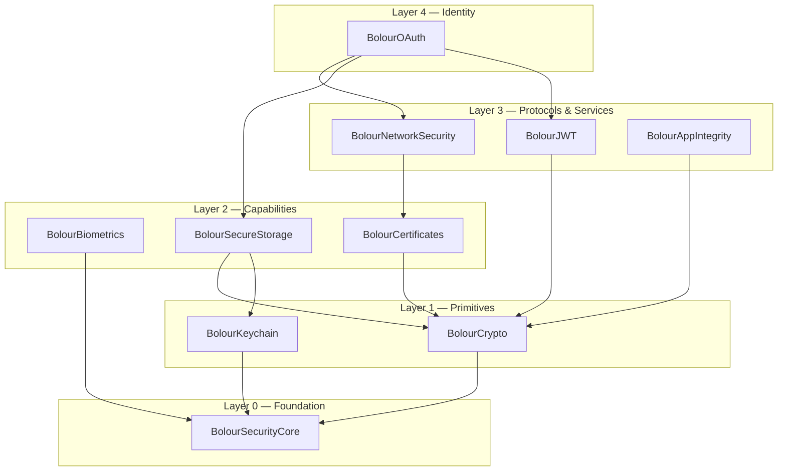

# BolourSecurity Architecture

This document defines the structural rules of the BolourSecurity ecosystem: the modules, the layers, the dependency policy, the concurrency model, and the physical package layout. Rationale for each major decision lives in the [Architecture Decision Records](adr/).

## 1. Design Overview

BolourSecurity is a **single Swift package** exposing **eleven library products** organized into **five strict layers**. Each module has exactly one responsibility. Dependencies point strictly downward; there are no cycles and no lateral imports within a layer.



The umbrella product **BolourSecurity** re-exports all modules for apps that want everything with one `import`.

## 2. The Modules

| Layer | Module | One responsibility | Wraps / builds on | Spec |
|---|---|---|---|---|
| 0 | `BolourSecurityCore` | Shared security vocabulary: errors, protection policies, `SecureBytes`, protocol seams, redacting logging | Foundation, os.log | [Spec](modules/BolourSecurityCore.md) |
| 1 | `BolourCrypto` | Cryptographic operations: hashing, symmetric/asymmetric encryption, signing, key agreement, KDFs, secure randomness, Secure Enclave keys | CryptoKit, Security | [Spec](modules/BolourCrypto.md) |
| 1 | `BolourKeychain` | Typed, safe keychain persistence with explicit protection and sync semantics | Keychain Services | [Spec](modules/BolourKeychain.md) |
| 2 | `BolourBiometrics` | Local user authentication: Face ID, Touch ID, Optic ID, passcode policies | LocalAuthentication | [Spec](modules/BolourBiometrics.md) |
| 2 | `BolourCertificates` | X.509 parsing, trust evaluation, pinning policy definition | Security (SecTrust) | [Spec](modules/BolourCertificates.md) |
| 2 | `BolourSecureStorage` | Encrypted file vaults and secret/token stores above Keychain + Crypto | Data Protection, FileManager | [Spec](modules/BolourSecureStorage.md) |
| 3 | `BolourNetworkSecurity` | Enforcing certificate pinning and TLS policy in URLSession | URLSession delegate APIs | [Spec](modules/BolourNetworkSecurity.md) |
| 3 | `BolourJWT` | JOSE: JWS signing/verification, JWK(S), claims validation | (pure, on BolourCrypto) | [Spec](modules/BolourJWT.md) |
| 3 | `BolourAppIntegrity` | App Attest and DeviceCheck lifecycle | DCAppAttestService, DCDevice | [Spec](modules/BolourAppIntegrity.md) |
| 4 | `BolourOAuth` | OAuth 2.1 / OpenID Connect with mandatory PKCE, web auth sessions, token lifecycle | AuthenticationServices | [Spec](modules/BolourOAuth.md) |
| — | `BolourSecurity` | Umbrella re-export | all of the above | [Spec](modules/BolourSecurity.md) |

The consolidation from the original fourteen-module sketch to this set is recorded in [ADR-0005](adr/0005-consolidated-module-set.md).

## 3. Dependency Rules

1. **Downward only.** A module may import modules from strictly lower layers. Never same-layer, never upward.
2. **Core is the only universal dependency.** Every module imports `BolourSecurityCore`; `BolourSecurityCore` imports only Apple SDKs.
3. **Protocol seams live in Core.** When a higher module needs a capability abstractly (e.g. `BolourOAuth` needs "a place to store tokens"), the protocol (`SecretStore`) is defined in Core and the concrete type (`BolourSecureStorage.TokenStore`) conforms. This keeps modules independently importable and independently testable.
4. **Zero third-party dependencies** — including test and build plugins. See [ADR-0002](adr/0002-zero-third-party-dependencies.md).
5. **No transitive API leakage.** A module's public API never exposes types from a lower module's *implementation details*; it may expose lower-module *public* types deliberately (e.g. `BolourJWT` accepts `BolourCrypto.SigningKey`), and each such exposure is a documented decision.

CI enforces rules 1–4 mechanically (import statement linting + `Package.swift` target audit).

## 4. Package Structure

One repository, one `Package.swift`, eleven products. A single package (rather than one repo per module) keeps versions atomic — a security fix in Core ships everywhere simultaneously — while SPM products preserve à-la-carte importing. Rationale: [ADR-0001](adr/0001-modular-package-ecosystem.md).

```swift
// Package.swift (shape only — authored in v0.1, shown here as design)
let package = Package(
    name: "BolourSecurity",
    platforms: [.iOS(.v16), .macOS(.v13), .watchOS(.v9), .visionOS(.v1)],
    products: [
        .library(name: "BolourSecurity", targets: ["BolourSecurity"]),          // umbrella
        .library(name: "BolourSecurityCore", targets: ["BolourSecurityCore"]),
        .library(name: "BolourCrypto", targets: ["BolourCrypto"]),
        .library(name: "BolourKeychain", targets: ["BolourKeychain"]),
        .library(name: "BolourBiometrics", targets: ["BolourBiometrics"]),
        .library(name: "BolourCertificates", targets: ["BolourCertificates"]),
        .library(name: "BolourSecureStorage", targets: ["BolourSecureStorage"]),
        .library(name: "BolourNetworkSecurity", targets: ["BolourNetworkSecurity"]),
        .library(name: "BolourJWT", targets: ["BolourJWT"]),
        .library(name: "BolourAppIntegrity", targets: ["BolourAppIntegrity"]),
        .library(name: "BolourOAuth", targets: ["BolourOAuth"]),
    ],
    // targets mirror products 1:1, plus one test target per module
)
```

**Platform floor:** iOS 16 / iPadOS 16, macOS 13, watchOS 9, visionOS 1. This floor guarantees `async/await`, CryptoKit maturity, App Attest, and modern LocalAuthentication everywhere, so no public API ever needs a callback or availability-forked signature. Raising the floor is a *minor* version event; APIs gated on newer OSes use `@available` and are additive.

**Swift floor:** Swift 6 language mode, strict concurrency = complete. See [ADR-0003](adr/0003-swift6-strict-concurrency.md).

## 5. Repository Layout (target state, after code lands)

```
BolourSecurity/
├── Package.swift
├── Sources/
│   ├── BolourSecurityCore/
│   │   ├── Errors/            # SecurityError protocol + shared error infrastructure
│   │   ├── Protection/        # AccessPolicy, ProtectionPolicy, UserPresencePolicy
│   │   ├── Memory/            # SecureBytes
│   │   ├── Seams/             # SecretStore, TrustEvaluating, AttestationProviding …
│   │   ├── Logging/           # SecurityEventLogger (redacting)
│   │   └── BolourSecurityCore.docc/
│   ├── BolourCrypto/
│   │   ├── Hashing/  Symmetric/  Asymmetric/  Signing/
│   │   ├── KeyDerivation/  Random/  SecureEnclave/
│   │   └── BolourCrypto.docc/
│   ├── … (one directory per module, same pattern: feature folders + .docc catalog)
│   └── BolourSecurity/          # umbrella: @_exported imports only
├── Tests/
│   ├── BolourSecurityCoreTests/
│   ├── BolourCryptoTests/
│   ├── … (one Swift Testing target per module)
│   └── IntegrationTests/      # cross-module suites; device-required suites tagged
├── Benchmarks/                # package-benchmark style micro-benchmarks per module
├── Examples/
│   ├── SecureNotes/           # showcase: Vault + Biometrics + Keychain
│   └── SignInDemo/            # showcase: OAuth + JWT + Pinning + AppIntegrity
├── docs/                      # this documentation set (architecture, strategy, ADRs)
└── .github/                   # CI workflows, templates
```

Conventions: one type per file; file name equals primary type name; feature folders, never `Utils/`; `internal` is the default access level and `public` is a reviewed decision.

## 6. Concurrency Model

- **Values everywhere possible.** Policies, keys, digests, certificates, tokens, and errors are `Sendable` value types. Most of the API surface is nonisolated and safe to use from any actor.
- **Actors where state truly lives.** Exactly three places hold mutable state and are actors: token refresh (`BolourOAuth.TokenManager` — serializes refresh so concurrent requests trigger one refresh), vault file handles (`BolourSecureStorage.Vault`), and attestation key lifecycle (`BolourAppIntegrity.AttestationService`).
- **No global mutable state, no singletons** in public API. Anything shared is an explicit instance the app owns and injects. (`Keychain` is a value; two instances with the same configuration are interchangeable.)
- **`@MainActor` only where UIKit/AppKit demands it** (presentation anchors for web auth and biometric prompts), expressed in the type signature, never assumed.
- **Typed throws** (`throws(KeychainError)`) on every API with a closed failure domain. See [ADR-0004](adr/0004-typed-throws-error-architecture.md).

## 7. Error Architecture

One protocol in Core; one concrete error enum per module:

- `SecurityError` (Core protocol): `LocalizedError & CustomDebugStringConvertible & Sendable`, adding `failureIsRecoverable: Bool` and a redaction guarantee — conforming types must never carry secret material in any description.
- Each module defines its own typed error (`KeychainError`, `CryptoError`, `BiometricError`, `PinningError`, `JWTError`, `OAuthError`, …) conforming to `SecurityError`, thrown via typed `throws`.
- Every error case carries: what failed, the most likely cause, and a recovery suggestion. Error messages are part of the reviewed API surface.

## 8. Secure Enclave & Hardware Strategy

Hardware-backed keys are a first-class concept, not an add-on: `BolourCrypto.SecureEnclaveKey` is the preferred signing/agreement key type wherever the platform supports it, and higher modules (`BolourAppIntegrity`, `BolourSecureStorage` master keys) build on it by default. Software fallback is explicit, never silent. See [ADR-0006](adr/0006-secure-enclave-first-key-design.md).

## 9. What BolourSecurity Deliberately Does Not Do

- **No custom cryptographic primitives.** If CryptoKit/Security can't do it, we don't ship it (Manifesto, Law 7).
- **No server-side SDK.** We document server verification protocols (App Attest, JWT) and ship reference test vectors, but server implementations are out of scope for the package.
- **No UI components.** We integrate with system UI (biometric prompts, `ASWebAuthenticationSession`); we never draw our own security UI, which users cannot distinguish from spoofed UI.
- **No analytics, no telemetry, no network calls** except those the developer explicitly initiates (OAuth flows, JWKS fetch).

## 10. Architecture Decision Records

| ADR | Decision |
|---|---|
| [0001](adr/0001-modular-package-ecosystem.md) | Single package, multiple products — not a package-per-module federation |
| [0002](adr/0002-zero-third-party-dependencies.md) | Zero third-party dependencies, permanently |
| [0003](adr/0003-swift6-strict-concurrency.md) | Swift 6 language mode with complete strict concurrency |
| [0004](adr/0004-typed-throws-error-architecture.md) | Typed throws with per-module error domains |
| [0005](adr/0005-consolidated-module-set.md) | Consolidated 11-module ecosystem (from the 14-module sketch) |
| [0006](adr/0006-secure-enclave-first-key-design.md) | Secure Enclave-first key design with explicit software fallback |

New structural decisions require a new ADR (see [template](adr/template.md)) before implementation.
